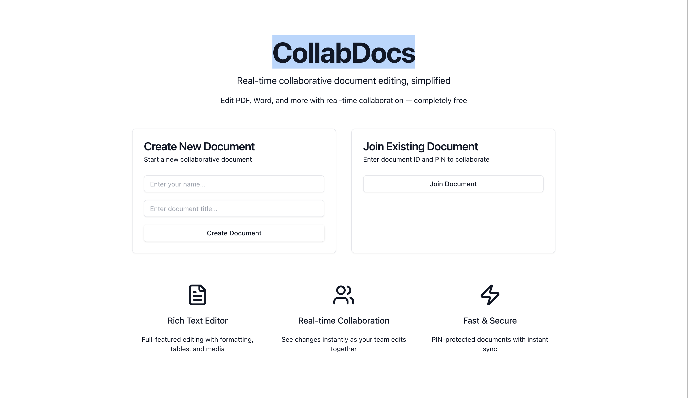

# [CollabDocs](https://collabdocs-site.vercel.app/)



---

## 📝 Real-Time Collaborative Document Editor

CollabDocs is a seamless, real-time collaborative document editor designed for easy document creation, sharing, and teamwork — entirely without user accounts. Experience instant collaboration powered by the latest web technologies, including Next.js, Hocuspocus, Y.js, and PostgreSQL. The simple UI, fast performance, and PDF integration make it the perfect tool for sharing ideas and working together.

---

## 🚀 Features

- **Create documents without login**
- **Invite collaborators using a 9-digit docId & 4-digit pin**
- **Collaborate in real-time using Y.js and Hocuspocus**
- **Import PDFs directly into the editor (pdf.js)**
- **Export your work as a PDF (html2pdf.js)**
- **Each document assigned a unique UUID**
- **Shareable docId for quick access**
- **Name storage is temporary and client-side only**
- **Clean, fast, and responsive interface**
- **Effortless document sharing and joining**
- **Robust backend validation for secure collaboration**

---

## ⚒️ Tech Stack

**Backend**

- Node.js
- Express
- Prisma
- PostgreSQL
- axios

**WebSocket Server**

- Hocuspocus Server
- Y.js
- axios (for backend validation)

**Frontend**

- Next.js
- React
- Tailwind CSS
- Tiptap (Yjs editor)
- pdf.js (PDF import)
- html2pdf.js (PDF export)
- axios

---

## ☁️ Deployment

- **Backend & WebSocket**: Hosted on [Render](https://render.com/)
- **Frontend**: Hosted on [Vercel](https://vercel.com/) or [Render](https://render.com/)

---

## 🔗 Deployment Links

- **Frontend**: [https://collabdocs-site.vercel.app/](https://collabdocs-site.vercel.app/)
- **Backend & WebSocket**: _[Add deployment URLs here as needed]_

---

## 🛠️ Installation

### 1. Running the Frontend Locally

```bash
git clone https://github.com/BadadheVed/Simple-Collabrative-Editor.git
cd Simple-Collabrative-Editor  # adjust path if frontend is in a subfolder

npm install
npm run dev
# Visit http://localhost:3000
```

### 2. Running the Backend Locally

```bash
cd backend  # adjust to your backend folder

npm install
npm run dev
# Default: http://localhost:4000
```

### 3. Running the WebSocket Server Locally

```bash
cd websocket-server  # adjust if separated

npm install
npm run dev
# Default: ws://localhost:8080
```

---

## 🐳 Docker Setup

Run all services with Docker for a fast local development environment.

### Build & Start All Services

**Frontend**

```bash
docker build -t collabdocs-frontend ./frontend
docker run -p 3000:3000 collabdocs-frontend
```

**Backend**

```bash
docker build -t collabdocs-backend ./backend
docker run -p 4000:4000 collabdocs-backend
```

**WebSocket Server**

```bash
docker build -t collabdocs-ws ./websocket-server
docker run -p 8080:8080 collabdocs-ws
```

Or, use `docker-compose` for multi-service orchestration:

```yaml
version: "3"
services:
  frontend:
    build: ./frontend
    ports:
      - "3000:3000"
  backend:
    build: ./backend
    ports:
      - "4000:4000"
  websocket:
    build: ./websocket-server
    ports:
      - "8080:8080"
```

```bash
docker-compose up
```

---

## 💬 Get Started with CollabDocs!

CollabDocs empowers teams, friends, and colleagues to collaborate instantly with security and ease.  
No sign-up required — just create, share, and work together.  
Enjoy smooth editing, PDF support, and modern design.

**Feel free to star ⭐️ this project, contribute, and share with the community!**

---
